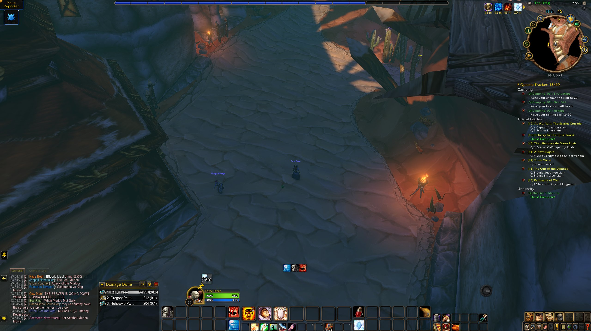
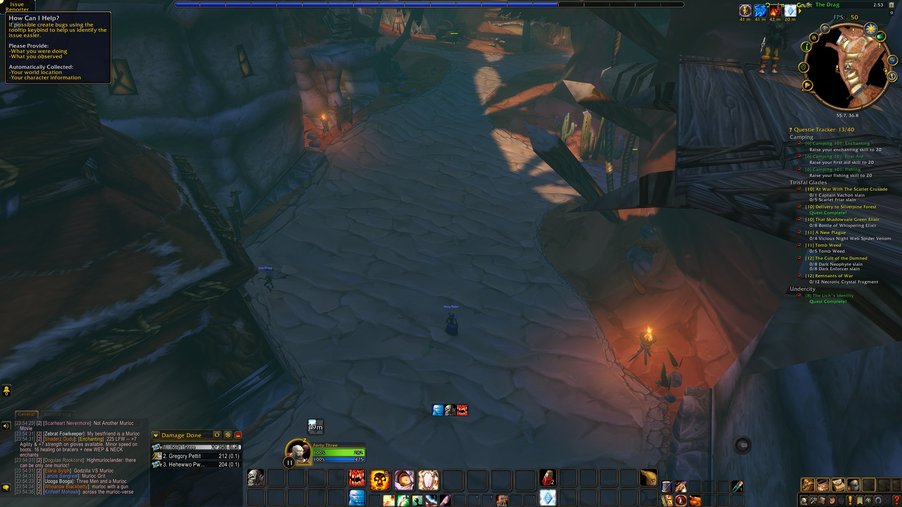
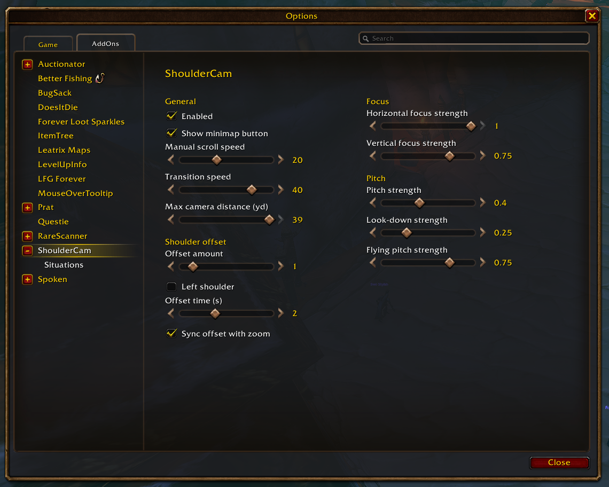
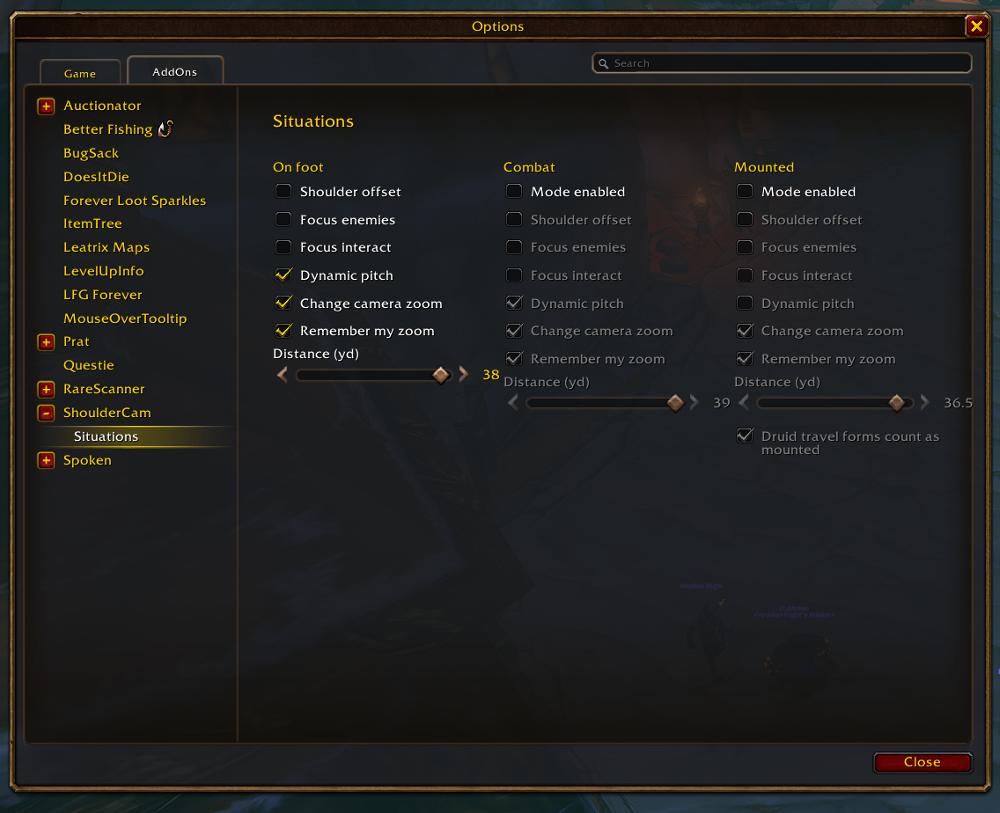

<h1 align="center">ShoulderCam</h1>

<b>Over-the-shoulder action camera with separate on foot, combat and mounted setups, and nothing that slows your game down.</b>

  
  

## Why players install it

- **The game's own action camera, tamed.** Shoulder offset, enemy and interact focus, dynamic pitch, all from the normal options window.
- **A camera for every situation.** On foot, Combat and Mounted each get their own shoulder offset, focus, pitch and zoom distance. The camera switches by itself when you mount up or enter combat.
- **Smooth moves.** The camera glides to each mode's zoom distance and slides over to the shoulder instead of snapping.
- **Remembers your zoom.** Scroll to a distance you like and that mode keeps it.
- **No nag popup.** The "experimental feature" warning stays away.
- **It stays out of the way.** No per-frame updates, no libraries. Timers run only while the camera is moving.

## Settings

Options > AddOns > ShoulderCam, or type `/shouldercam` (or `/shc`). Every change takes effect immediately.

- **ShoulderCam** page: turn the addon on or off, zoom speeds, max camera distance, shoulder offset, focus and pitch strength.
- **Situations** page: On foot, Combat and Mounted side by side. Druid travel forms can count as mounted.

  
  

The **Defaults** button on either page resets everything. Key bindings (Options > Keybindings > ShoulderCam): **Toggle ShoulderCam** and **Swap shoulder**. The addon menu button on the minimap (Retail) opens the settings too.

A ShoulderCam button on the minimap edge opens the settings with a left-click and turns the camera on or off with a right-click. Drag it to move it around the minimap. Untick **Show minimap button** on the ShoulderCam page to hide it.

Using ActionCamPlus? Turn it off first: both addons change the same camera settings.

## Game versions

Retail, Classic Era, TBC, Wrath, Cata, Mists Classic and WoW: Forever. If a game version has no action camera, ShoulderCam does nothing and says so on its settings page.

## Performance

- No per-frame updates: zoom uses the game's own camera movement, and the shoulder slide runs on a short timer that stops when it arrives.
- Mount and combat events are listened to only while that mode is turned on.
- Switching modes changes only the camera settings that actually differ.
- The settings pages are built the first time you open them.

## License

MIT
